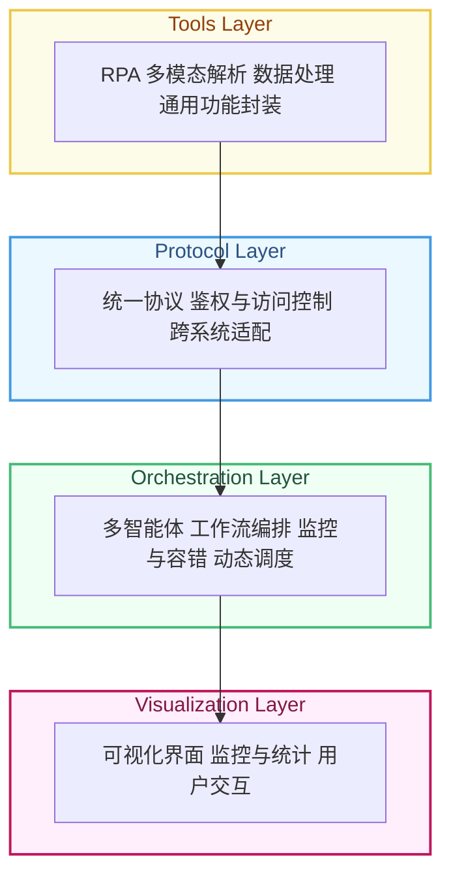

# 架构设计

> 由于自动化代码构建容易构建出架构混乱的项目，例如测试示例会跨层调用和修改代码，当我们在进行编写编排层和测试时，会尝试跨层调用工具层代码，这代表着debug时会更改工具层代码，导致原本已调试正确的协议层代码出错。
>
> 设计架构和使用cursor自动编写代码时，需要先广泛分析我们所需的协议，需要创建哪些工具，再逐一创建协议并测试，而非直接创建编排层示例进行测试，跨层测试会导致项目架构崩溃。
>
> 在多层应用架构中，若一开始的层级划分不够谨慎，开发者在编排层或测试场景下必然会跨层调用底层代码，导致彼此依赖错综复杂。为避免这种“层与层之间的耦合与互相牵制”，需要先行明确各层的职责与接口，优先完成工具层与协议层的独立测试，再在编排层中使用稳定且对外暴露的接口，避免跨层直接 Debug。唯有这样，才能充分发挥自动化应用构建工具的优势，并持续保持项目结构的清晰与可维护性。
>
> 每一层需要一个详细的README说明：本层的作用，本层现有的 函数、方法、类 的接口格式和作用，如果有更底层，例如协议层的底层是工具层，则说明该层的每一个 函数、方法、类 调用了底层的什么 函数、方法、类 。
>
> 每一层单独进行单元测试，测试debug仅允许修改在测试的这一层的代码。

## 架构分层

## 开发步骤

### 业务导向

- 分析潜在的应用场景以及业务
- 分解业务线为协议
- 检查是否有可复用协议
  - 如果全部可以复用，则使用现有协议完成编排层开发
  - 如果不可全部复用则开发新协议
    - 检查是否有工具可以复用
      - 如果全部可以复用，则使用现有工具完成协议层开发
      - 否则开发并单元测试新工具

分析自上而下，开发自下而上

### 功能导向

- 开发并测试新工具类
- 将工具封装为协议

## 层级说明

### 工具层

各种工具类

### 协议层

将不同接口的工具类写成统一MCP协议的格式

### 编排层（LLM）

- 按任务自动规划工作流和调用协议

- 按任务补全工作流缺失协议

### 可视化层

可视化编排层，使得可以可视化手动编排工作流

## 固定提示词编写

请阅读本项目代码结构以及开发基础架构说明文档，了解该项目的开发规范和范式。

## 参考工具

### RPA

https://github.com/tebelorg/RPA-Python

### Agent

https://github.com/camel-ai/camel

https://github.com/camel-ai/owl

### MCP

https://deepseek.csdn.net/67e383ff45a25f3de59f7bb0.html

https://github.com/liaokongVFX/MCP-Chinese-Getting-Started-Guide
